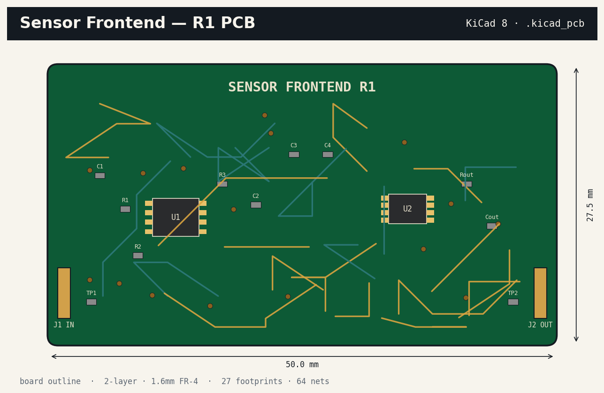

<div align="center">

# Electronics Design & Simulation Portfolio

**by Katherine Feemster**

### Senior Electronics Design & Simulation (EDA) Specialist · KiCad · LibrePCB · Ngspice · Qucs-s

[🌐 **Live portfolio site**](https://katherinejenniferhsfeemster.github.io/eda-design-simulation-portfolio/) · [GitHub repo](https://github.com/katherinejenniferhsfeemster/eda-design-simulation-portfolio)

      

*Code-first electronics — schematic capture, PCB layout, SPICE characterisation and S-parameter sweeps, all emitted from a single reproducible Python pipeline.*

</div>

---

## Contents

- [Highlighted projects](#highlighted-projects)
- [Reproducibility](#reproducibility)
- [Tech stack](#tech-stack)
- [Editorial style](#editorial-style)
- [Repo layout](#repo-layout)
- [About the author](#about-the-author)
- [Contact](#contact)

---

## Hero



---

## Highlighted projects

| Project | Stack | What it proves |
| :-- | :-- | :-- |
| **[KiCad ECG analog front-end](cases/kicad/)** | KiCad 8 · S-expression | Valid `.kicad_pro` / `.kicad_sch` / `.kicad_pcb` tree with netlist, BOM and fab summary. |
| **[LibrePCB portable netlist](cases/librepcb/)** | LibrePCB 1.x · S-expression | Mirrors the AFE inside LibrePCB's native `.lpp` project — proves netlist portability. |
| **[Ngspice AC / tran / MC / noise](cases/ngspice/)** | Ngspice 41 · SPICE | Four decks: Bode, transient step, 200-run Monte-Carlo, input-referred noise. |
| **[Qucs-s 50 MHz RF band-pass](cases/qucs-s/)** | Qucs-s 2.x · Qucs XML | Dual-π LC matching with S11 Smith chart + S21 mag/phase from 10 MHz to 500 MHz. |

---

## Reproducibility

```bash
pip install numpy scipy matplotlib
python3 src/run_all.py
```

Each case also emits the native project file (KiCad S-expression, LibrePCB `.lpp`, Ngspice `.cir`, Qucs XML) so the artefact opens in the real tool unchanged.

---

## Tech stack

- **KiCad 8** — S-expression schematic + PCB, hierarchical sheets, ERC/DRC rule sets, BOM generation, fab-ready output.
- **LibrePCB 1.x** — Strict `.lpp` project layout, flattened project library, Wayland-friendly headless rendering for containerised CI.
- **Ngspice 41** — Batch SPICE (`ngspice -b`), AC / DC / TRAN / NOISE / MC, `.meas` post-processing, vendor-model import.
- **Qucs-s 2.x** — Qucs XML schematic capture with Ngspice back-end, linear S-parameter sweeps, harmonic balance.
- **Python toolchain** — ABCD-matrix S-parameter solver, Monte-Carlo sweep harness, scipy.signal reproduction of SPICE transients.

---

## Editorial style

- **Palette** — teal `#2E7A7B` + amber `#D9A441` on ink `#0F1A1F` / paper `#FBFAF7`.
- **Type** — Inter (UI) + JetBrains Mono (code, netlists, timecode).
- **Determinism** — every generator is seeded; PNG, CSV and project-file bytes are stable across CI runs.
- **Licensing** — every tool in the pipeline is FOSS. No commercial SDK in the dependency tree.

---

## Repo layout

```
eda-design-simulation-portfolio/
├── src/                         # 4 generators + art_helpers.py + run_all.py
├── cases/                       # one folder per tool with the native project file
│   ├── kicad/sensor_frontend/   # .kicad_pro / _sch / _pcb / .net / _bom.csv
│   ├── librepcb/                # .lpp project tree
│   ├── ngspice/                 # 4 .cir decks + models/ + run_all.sh
│   └── qucs-s/                  # rf_bandpass.sch + rf_bandpass.ngspice
├── assets/                      # generated posters, CSVs, fab_summary.json
├── docs/                        # GitHub Pages site
└── .github/workflows/           # CI re-runs the pipeline on each push
```

---

## About the author

Senior electronics design & simulation specialist shipping cross-tool circuit pipelines — analog front-ends, mixed-signal boards, and RF matching networks. Comfortable owning a project from circuit synthesis through schematic capture, layout, SPICE characterisation, Monte-Carlo yield analysis and S-parameter verification.

Open to remote and contract engagements. This repository is the living portfolio companion to my CV.

---

## Contact

**Katherine Feemster**

- GitHub — [@katherinejenniferhsfeemster](https://github.com/katherinejenniferhsfeemster)
- Live site — [katherinejenniferhsfeemster.github.io/eda-design-simulation-portfolio](https://katherinejenniferhsfeemster.github.io/eda-design-simulation-portfolio/)
- Location — open to remote / contract

---

<div align="center">
<sub>Built diff-first, editor-second. Every figure on this page is produced by code in this repo.</sub>
</div>
